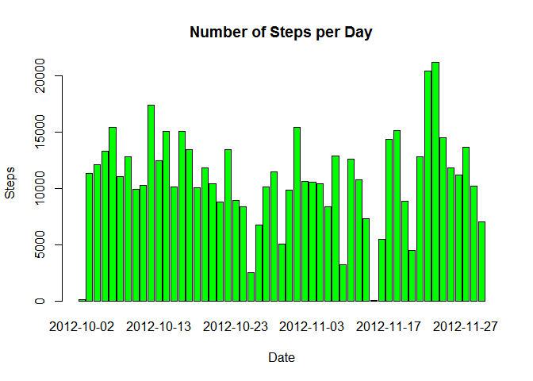
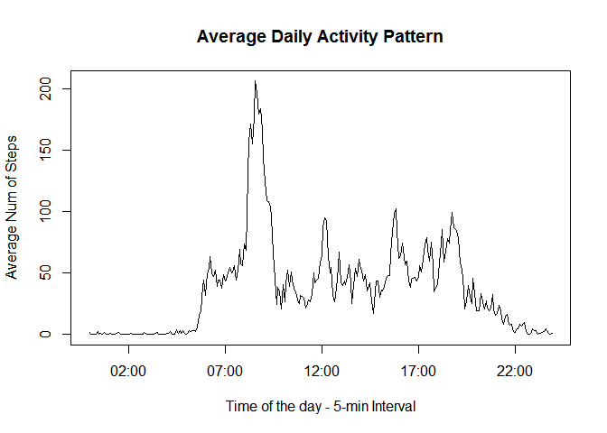
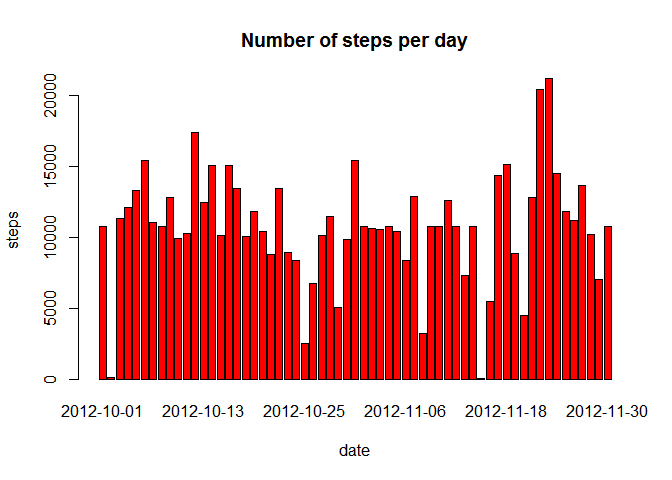
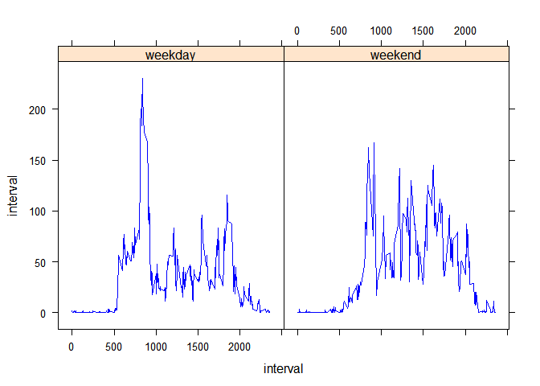

# Reproducible Research: Peer Assessment 1


## Loading and preprocessing the data


```r
  # Repo
  #       The Repo was forked  on 2015-Apr-15 at 06:40 a.m. pt
  #       The Repo was clonned on 2015-Apr-15 at 06:49 a.m. pt

  # Data 
  #       AMD      - Activity Monitoring Data
  #       Source   - https://d396qusza40orc.cloudfront.net/repdata%2Fdata%2Factivity.zip
  #                  Size - 52K
  #                  It is zipped
  #                  Records - 17,568
  #       Variables-
  #                  Steps    - No of.. or NA (Missing Value)
  #                  Date     - (YYYY-MM-DD)
  #                  Interval - Identifier for the 5-minute interval in which measurement was taken
 


  # Clean up workspace
        rm(list=ls()); 
        
  # set working directory 
        setwd('C:/Users/hgrisales/Documents/Coursera/AMD'); 

  # Load the data 
  # The file was downloaded on 2015-Apr-15 at 06:33 a.m. pt
        raw_data <- read.csv("activity.csv" , header=TRUE)

  # Explore the data
        head(raw_data)
```

```
##   steps       date interval
## 1    NA 2012-10-01        0
## 2    NA 2012-10-01        5
## 3    NA 2012-10-01       10
## 4    NA 2012-10-01       15
## 5    NA 2012-10-01       20
## 6    NA 2012-10-01       25
```

```r
        summary(raw_data)
```

```
##      steps                date          interval     
##  Min.   :  0.00   2012-10-01:  288   Min.   :   0.0  
##  1st Qu.:  0.00   2012-10-02:  288   1st Qu.: 588.8  
##  Median :  0.00   2012-10-03:  288   Median :1177.5  
##  Mean   : 37.38   2012-10-04:  288   Mean   :1177.5  
##  3rd Qu.: 12.00   2012-10-05:  288   3rd Qu.:1766.2  
##  Max.   :806.00   2012-10-06:  288   Max.   :2355.0  
##  NA's   :2304     (Other)   :15840
```

```r
  # Split the data
        Total_Steps_By_Day_without_NA <-aggregate(steps~date, data=raw_data,sum, na.rm=TRUE)

        summary(Total_Steps_By_Day_without_NA)
```

```
##          date        steps      
##  2012-10-02: 1   Min.   :   41  
##  2012-10-03: 1   1st Qu.: 8841  
##  2012-10-04: 1   Median :10765  
##  2012-10-05: 1   Mean   :10766  
##  2012-10-06: 1   3rd Qu.:13294  
##  2012-10-07: 1   Max.   :21194  
##  (Other)   :47
```


## What is mean total number of steps taken per day?


```r
  # Mean Total steps by Day
   mean(Total_Steps_By_Day_without_NA$steps)
```

```
## [1] 10766.19
```

```r
# Median Total steps by Day
   median(Total_Steps_By_Day_without_NA$steps, na.rm = TRUE)
```

```
## [1] 10765
```

```r
# Histogram - distribution of total number of steps per day

   barplot(Total_Steps_By_Day_without_NA$steps, names.arg =Total_Steps_By_Day_without_NA$date, main="Number of Steps per Day",xlab="Date", ylab="Steps", col=c("green"))
```

 

## What is the average daily activity pattern?


```r
    # Create a date-time column that combines the date and interval columns.

        DateTime <- formatC(raw_data$interval/100, 2, format = "f")
        raw_data$date.DateTime <- as.POSIXct(paste(raw_data$date, DateTime),format = "%Y-%m-%d %H.%M", tz = "GMT") 

        raw_data$DateTime <- format(raw_data$date.DateTime, format = "%H:%M:%S")
        raw_data$DateTime <- as.POSIXct(raw_data$DateTime, format = "%H:%M:%S")

        mean.steps <- tapply(raw_data$steps, raw_data$DateTime, mean, na.rm = TRUE)
        daily.pattern <- data.frame(DateTime = as.POSIXct(names(mean.steps)), mean.steps = mean.steps)

       
       plot(daily.pattern$DateTime, daily.pattern$mean.steps, type = "l", xlab = "Time of the day - 5-min Interval", ylab = "Average Num of Steps", main = "Average Daily Activity Pattern")
```

 

## Imputing missing values


```r
    na_records <- nrow(raw_data[!complete.cases(raw_data),])
    print(sprintf("Records wit NA data: %i ", na_records))
```

```
## [1] "Records wit NA data: 2304 "
```

```r
   #  Methodology:
   #  Replace NA step values- use mean steps for a five-minute interval for the entire dataset

        Average_Steps_By_Interval <-aggregate(steps~ interval , data=raw_data,mean, na.rm=TRUE)

        raw_data <- merge(raw_data,Average_Steps_By_Interval, by = "interval", suffixes = c("",".y"))
        nas <- is.na(raw_data$steps)
        raw_data$steps[nas] <- raw_data$steps.y[nas]
        raw_data_new <- raw_data[, c(1:3)]

        steps_per_day<-aggregate(steps ~ date, raw_data_new, sum)
        barplot(steps_per_day$steps, names.arg=steps_per_day$date, xlab="date", ylab="steps", main="Number of steps per day", col="red")
```

 

## Are there differences in activity patterns between weekdays and weekends?


```r
        library(lattice)
        raw_data_new$date<-as.Date(raw_data_new$date,format = '%Y-%m-%d')
        raw_data_new$day <- ifelse(weekdays(raw_data_new$date) %in% c("Saturday", "Sunday"),'weekend','weekday')
        head(raw_data_new)
```

```
##   interval    steps       date     day
## 1        0 1.716981 2012-10-01 weekday
## 2        0 0.000000 2012-11-23 weekday
## 3        0 0.000000 2012-10-28 weekend
## 4        0 0.000000 2012-11-06 weekday
## 5        0 0.000000 2012-11-24 weekend
## 6        0 0.000000 2012-11-15 weekday
```

```r
        steps_by_interval_and_Daytype<-aggregate(steps~ interval+day,raw_data_new,FUN="mean")
        head(steps_by_interval_and_Daytype)
```

```
##   interval     day      steps
## 1        0 weekday 2.25115304
## 2        5 weekday 0.44528302
## 3       10 weekday 0.17316562
## 4       15 weekday 0.19790356
## 5       20 weekday 0.09895178
## 6       25 weekday 1.59035639
```

```r
        library(lattice)
        xyplot(steps ~ interval | day, steps_by_interval_and_Daytype, layout = c(2, 1), type = "l", col="blue", xlab="interval", ylab="interval")
```

 
